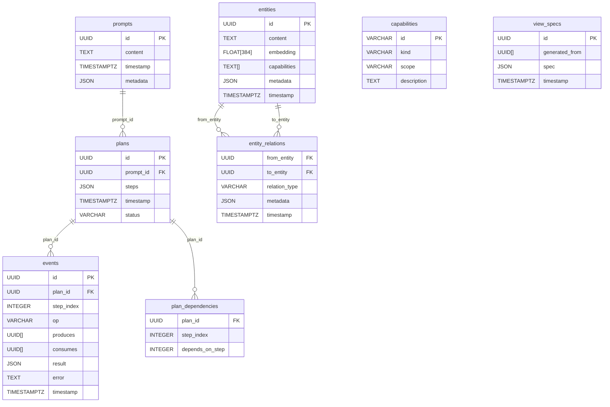

# poc-intent-router

> **⚠️ Experimental, vibe-coded software!**
>
> This project is a proof-of-concept (POC) for agentic intent routing with a dual-LLM security model. It is meant for inspiration, learning, and reference only—not for real-world or production use. Expect rough edges, incomplete features, and breaking changes. Use at your own risk!

For context on the design rationale behind this project, see my Patreon post: [A case for client side intent routing](https://www.patreon.com/posts/case-for-client-131833840).

---

## Overview

**poc-intent-router** is an experimental agentic notebook stack that demonstrates:
- Prompt → Plan → Event/Entity data flow
- Fine-grained CaMeL-style capability enforcement (dual-LLM security)
- Local planning with Qwen-3-4B (Ollama)
- Remote execution with Claude Sonnet 4 (Anthropic)
- DuckDB for storage, with property-graph and vector search

The stack is designed for rapid prototyping and research, not for production. See [CLAUDE.MD](./CLAUDE.MD) for the full agent spec and design notes.

---

## Quickstart

### Prerequisites
- **macOS or Linux** (Windows not officially supported)
- [Bun](https://bun.sh/) (>=1.0.0)
- [DuckDB](https://duckdb.org/) (with `vss` and `json` extensions)
- [Ollama](https://ollama.com/) (for local LLM planning)
- [Node.js](https://nodejs.org/) (for some tools, optional)

### 1. Install system dependencies
```bash
brew install bun duckdb ollama
```

### 2. Pull the planning model (Qwen-3-4B)
```bash
ollama pull qwen:3-4b
```

### 3. Clone and set up the project
```bash
git clone <this-repo-url>
cd poc-intent-router
bun install
cp .env.example .env   # See below for required env vars
```

### 4. Configure environment variables
Create a `.env` file with at least:
```
ANTHROPIC_API_KEY=sk-ant-...   # Your Anthropic Claude API key
EXECUTOR_MODEL=claude-3-5-sonnet-20241022  # (optional, default shown)
OLLAMA_ENDPOINT=http://localhost:11434      # (optional, default shown)
PLANNER_MODEL=qwen:3-4b                     # (optional, default shown)
USE_MOCK_PLANNER=false                      # (optional, for demo/testing)
```

### 5. Initialize the database
By default, the server uses an in-memory DuckDB. To use a persistent DB, edit `src/server.ts` and point to a file. To initialize the schema:
```bash
duckdb db.sqlite < database/schema.sql
```

### 6. Run the server
```bash
bun run dev
# or
bun run src/server.ts
```

### 7. (Optional) Start Ollama for local LLM
```bash
ollama serve &
```

### 8. (Optional) REPL for manual testing
If you have a `scripts/repl.ts`, run:
```bash
bun run scripts/repl.ts
```

---

## Architecture

- **Planner Agent**: Local LLM (Qwen-3-4B via Ollama) parses user prompts into deterministic JSON plans.
- **Policy Engine**: TypeScript in-proc, enforces CaMeL-style capability checks before every tool call.
- **Executor Agent**: Remote LLM (Claude Sonnet 4 via Anthropic API) executes high-cost reasoning and tool commands.
- **Embedding Agent**: (Planned) Uses OpenAI text-embedding-3-small for 384-dim vectors.
- **Indexer**: DuckDB with HNSW and property-graph extensions for hybrid vector + symbolic search.

### Data Model
- **Prompt**: Immutable record of user input
- **Plan**: Ordered, deterministic steps (JSON)
- **Entity**: Content chunk, carries capability tags
- **Event**: Append-only log, tracks produces/consumes
- **Capability**: Fine-grained tool/data caps
- **ViewSpec**: Transient UI spec, generated from entities

---

## Database Schema

### Entity-Relationship Diagram



### SQL Schema Mapping
See [`database/schema.sql`](./database/schema.sql) for the full DDL. The ER diagram above maps directly to the SQL tables, with additional indexes and default capabilities inserted for demo purposes.

---

## Capability Model (CaMeL-style)

- Every plan step declares required `tool_caps` and `data_caps`.
- The Policy Engine enforces:
  - All consumed entities' data_caps ⊆ step.data_caps
  - All step.tool_caps ⊆ CapabilityRegistry[step.op]
- If a check fails, a `CAPABILITY_VIOLATION` is raised and surfaced to the UI.

---

## API Endpoints

- `POST /prompt` — Submit a new prompt, returns a plan
- `GET /plans` — List all plans
- `GET /plans/:id` — Get a specific plan
- `POST /plans/:id/execute` — Execute a plan (stepwise)
- `GET /entities` — List all entities
- `GET /events` — List all events
- `GET /health` — Health check

See `src/server.ts` for implementation details.

---

## Extending Capabilities

Add new tool or data capabilities in `agents/capability-registry.ts` and ensure each tool implementation exports its required `tool_caps` for policy checks.

---

## License

MIT License

Copyright (c) 2025 Ankesh Bharti

Permission is hereby granted, free of charge, to any person obtaining a copy
of this software and associated documentation files (the "Software"), to deal
in the Software without restriction, including without limitation the rights
to use, copy, modify, merge, publish, distribute, sublicense, and/or sell
copies of the Software, and to permit persons to whom the Software is
furnished to do so, subject to the following conditions:

The above copyright notice and this permission notice shall be included in all
copies or substantial portions of the Software.

THE SOFTWARE IS PROVIDED "AS IS", WITHOUT WARRANTY OF ANY KIND, EXPRESS OR
IMPLIED, INCLUDING BUT NOT LIMITED TO THE WARRANTIES OF MERCHANTABILITY,
FITNESS FOR A PARTICULAR PURPOSE AND NONINFRINGEMENT. IN NO EVENT SHALL THE
AUTHORS OR COPYRIGHT HOLDERS BE LIABLE FOR ANY CLAIM, DAMAGES OR OTHER
LIABILITY, WHETHER IN AN ACTION OF CONTRACT, TORT OR OTHERWISE, ARISING FROM,
OUT OF OR IN CONNECTION WITH THE SOFTWARE OR THE USE OR OTHER DEALINGS IN THE
SOFTWARE.

---

## Credits & Inspiration
- [CLAUDE.MD](./CLAUDE.MD) — Full agent spec, design notes, and architecture
- [Ollama](https://ollama.com/), [Anthropic](https://www.anthropic.com/), [DuckDB](https://duckdb.org/)
- CaMeL, agentic notebooks, and the open-source agent ecosystem
