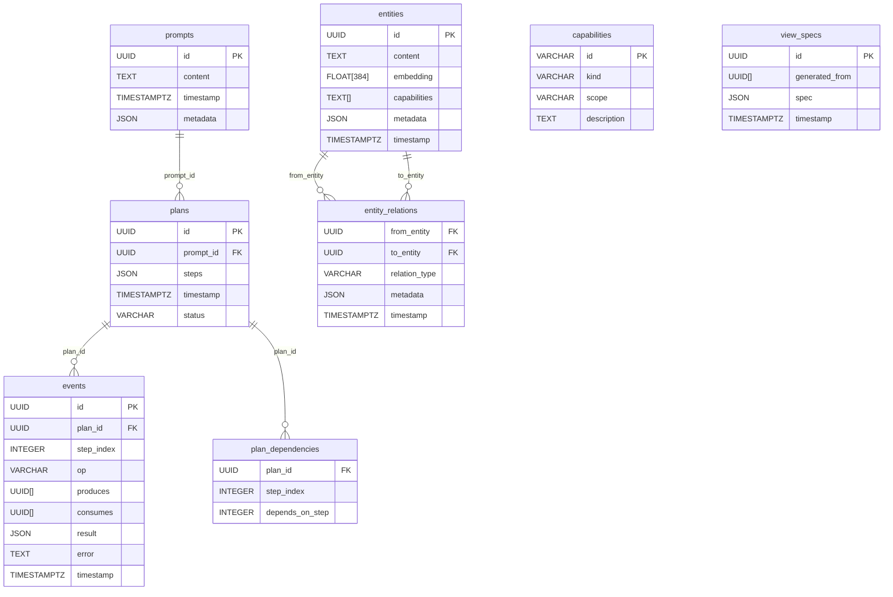

# poc-intent-router

> **⚠️ Experimental, vibe-coded software!**
>
> This project is a proof-of-concept (POC) for agentic intent routing with a dual-LLM security model. It is meant for inspiration, learning, and reference only—not for real-world or production use. Expect rough edges, incomplete features, and breaking changes. Use at your own risk!

For context on the design rationale behind this project, see my Patreon post: [A case for client side intent routing](https://www.patreon.com/posts/case-for-client-131833840).

---

## Overview

**poc-intent-router** is an experimental agentic notebook stack that demonstrates:
- Prompt → Plan → Event/Entity data flow
- Fine-grained CaMeL-style capability enforcement (dual-LLM security)
- Local planning with Qwen-3-4B (Ollama)
- Remote execution with Claude Sonnet 4 (Anthropic)
- DuckDB for storage, with property-graph and vector search

The stack is designed for rapid prototyping and research, not for production. See [CLAUDE.MD](./CLAUDE.MD) for the full agent spec and design notes.

---

## Quickstart

### Prerequisites
- **macOS or Linux** (Windows not officially supported)
- [Bun](https://bun.sh/) (>=1.0.0)
- [DuckDB](https://duckdb.org/) (with `vss` and `json` extensions)
- [Ollama](https://ollama.com/) (for local LLM planning)
- [Node.js](https://nodejs.org/) (for some tools, optional)

### 1. Install system dependencies
```bash
brew install bun duckdb ollama
```

### 2. Pull the planning model (Qwen-3-4B)
```bash
ollama run qwen3:4b
```

### 3. Clone and set up the project
```bash
git clone <this-repo-url>
cd poc-intent-router
bun install
cp .env.example .env   # See below for required env vars
```

### Dependencies

Key dependencies in this project:

- **ollama** (v0.5.16) - Official Ollama JavaScript library with structured outputs support
- **@anthropic-ai/sdk** - Anthropic Claude API client
- **@anysphere/priompt** - Priority-based prompt composition
- **@modelcontextprotocol/sdk** - MCP integration for extensible tools
- **duckdb** - In-process analytics database
- **zod** - TypeScript-first schema validation

### 4. Configure environment variables
Create a `.env` file with at least:
```
ANTHROPIC_API_KEY=sk-ant-...   # Your Anthropic Claude API key
EXECUTOR_MODEL=claude-sonnet-4-0  # (optional, default shown)
OLLAMA_ENDPOINT=http://localhost:11434      # (optional, default shown)
PLANNER_MODEL=qwen3:4b                     # (optional, default shown)
USE_MOCK_PLANNER=false                      # (optional, for demo/testing)
```

### 5. Initialize the database
By default, the server uses an in-memory DuckDB. To use a persistent DB, edit `src/server.ts` and point to a file. To initialize the schema:
```bash
duckdb db.sqlite < database/schema.sql
```

### 6. Run the server
```bash
bun run dev
# or
bun run src/server.ts
```

### 7. (Optional) Start Ollama for local LLM
```bash
ollama serve &
```

### 8. (Optional) REPL for manual testing
If you have a `scripts/repl.ts`, run:
```bash
bun run scripts/repl.ts
```

---

## Architecture

- **Planner Agent**: Local LLM (Qwen-3-4B via Ollama) parses user prompts into deterministic JSON plans using **ollama-js** with structured outputs and **Priompt** for intelligent prompt composition.
- **Policy Engine**: TypeScript in-proc, enforces CaMeL-style capability checks before every tool call.
- **Executor Agent**: Remote LLM (Claude Sonnet 4 via Anthropic API) executes high-cost reasoning and tool commands with **Priompt**-optimized prompts.
- **MCP Agent**: Model Context Protocol integration for extensible tool capabilities via filesystem and other MCP servers.
- **Embedding Agent**: (Planned) Uses OpenAI text-embedding-3-small for 384-dim vectors.
- **Indexer**: DuckDB with HNSW and property-graph extensions for hybrid vector + symbolic search.

### Data Model
- **Prompt**: Immutable record of user input
- **Plan**: Ordered, deterministic steps (JSON)
- **Entity**: Content chunk, carries capability tags
- **Event**: Append-only log, tracks produces/consumes
- **Capability**: Fine-grained tool/data caps
- **ViewSpec**: Transient UI spec, generated from entities

---

## Database Schema

### Entity-Relationship Diagram



### SQL Schema Mapping
See [`database/schema.sql`](./database/schema.sql) for the full DDL. The ER diagram above maps directly to the SQL tables, with additional indexes and default capabilities inserted for demo purposes.

---

## Capability Model (CaMeL-style)

- Every plan step declares required `tool_caps` and `data_caps`.
- The Policy Engine enforces:
  - All consumed entities' data_caps ⊆ step.data_caps
  - All step.tool_caps ⊆ CapabilityRegistry[step.op]
- If a check fails, a `CAPABILITY_VIOLATION` is raised and surfaced to the UI.

---

## API Endpoints

- `POST /prompt` — Submit a new prompt, returns a plan
- `GET /plans` — List all plans
- `GET /plans/:id` — Get a specific plan
- `POST /plans/:id/execute` — Execute a plan (stepwise)
- `GET /entities` — List all entities
- `GET /events` — List all events
- `GET /health` — Health check
- `POST /test/structured-outputs` — Test structured outputs functionality
- `GET /mcp/servers` — List MCP servers
- `POST /mcp/servers` — Add MCP server
- `GET /mcp/tools` — List available MCP tools

See `src/server.ts` for implementation details.

---

## Structured Outputs with Ollama

This project implements **Ollama's structured outputs feature** for guaranteed JSON compliance in plan generation. The planner agent uses the **ollama-js** library to enforce JSON schema validation at generation time.

### Key Features

- **Schema Enforcement**: JSON structure is validated by Ollama during generation
- **Type Safety**: Zod schemas provide runtime validation and TypeScript types
- **Error Prevention**: Eliminates JSON parsing errors and malformed responses
- **Performance**: Reduces token usage by eliminating format instructions
- **Reliability**: Guarantees consistent JSON structure across all model responses

### Implementation

The planner uses a JSON schema to enforce the step structure:

```typescript
const schema = {
  type: "array",
  items: {
    type: "object",
    properties: {
      op: { type: "string", description: "Operation name in snake_case" },
      args: { type: "object", description: "Operation arguments" },
      tool_caps: { type: "array", items: { type: "string" } },
      data_caps: { type: "array", items: { type: "string" } },
      deps: { type: "array", items: { type: "number" } }
    },
    required: ["op", "args", "tool_caps", "data_caps", "deps"]
  }
};

const response = await ollama.generate({
  model: "qwen3:4b",
  prompt: userPrompt,
  format: schema,  // Structured outputs enforcement
  stream: false
});
```

### Testing

Multiple test suites validate the structured outputs implementation:

- **CLI Testing**: `bun run test:cli` - Direct agent testing with real-time feedback
- **App Testing**: `bun run test:app` - Full end-to-end API validation
- **JSON Validation**: `bun run test:json` - Comprehensive schema compliance testing
- **Debug Mode**: `bun run debug-structured-outputs.ts` - Raw response inspection

---

## Prompt Engineering with Priompt

This project uses **[Priompt](https://github.com/anysphere/priompt)** for intelligent prompt composition with priority-based token inclusion. Priompt allows the system to:

- **Dynamically include/exclude prompt elements** based on priority when approaching token limits
- **Preserve critical instructions** while allowing less important context to be truncated
- **Optimize prompt efficiency** by including maximum relevant context within token constraints

### Key Features

- **Priority-based rendering**: Elements with higher `p` values (priority) are included first
- **Automatic token management**: Stays within specified token limits while maximizing useful context
- **Structured prompts**: Uses `SystemMessage` and `UserMessage` components for clear prompt structure

### Usage Examples

**Planner Agent**: Uses Priompt to structure planning prompts with:
- Core instructions (priority 10)
- User prompt (priority 9) 
- Available operations (priority 8)
- Tool capabilities (priority 6)
- Context history (variable priority based on recency/importance)

To pass context history to the planner, include a `contextHistory` array in your `PlannerRequest`:

```typescript
const request: PlannerRequest = {
  prompt: "Create a summary of the meeting notes",
  contextHistory: [
    { content: "Previous meeting focused on Q2 goals", priority: 4 },
    { content: "Recent project updates available", priority: 3 },
    { content: "User prefers concise summaries", priority: 7 }
  ]
};
```

**Executor Agent**: Uses Priompt to optimize execution prompts with:
- Core system instructions (priority 10)
- Operation details (priority 9)
- Final instruction (priority 8)
- Tool capabilities (priority 7)
- Context information (priority 6 - may be truncated for large contexts)

### Configuration

Both agents use configurable token limits:
- **Planner**: 4000 tokens (adjustable for your local model)
- **Executor**: 8000 tokens (adjustable for Claude's context limit)

---

## Extending Capabilities

Add new tool or data capabilities in `agents/capability-registry.ts` and ensure each tool implementation exports its required `tool_caps` for policy checks.

---

## License

MIT License

Copyright (c) 2025 Ankesh Bharti

Permission is hereby granted, free of charge, to any person obtaining a copy
of this software and associated documentation files (the "Software"), to deal
in the Software without restriction, including without limitation the rights
to use, copy, modify, merge, publish, distribute, sublicense, and/or sell
copies of the Software, and to permit persons to whom the Software is
furnished to do so, subject to the following conditions:

The above copyright notice and this permission notice shall be included in all
copies or substantial portions of the Software.

THE SOFTWARE IS PROVIDED "AS IS", WITHOUT WARRANTY OF ANY KIND, EXPRESS OR
IMPLIED, INCLUDING BUT NOT LIMITED TO THE WARRANTIES OF MERCHANTABILITY,
FITNESS FOR A PARTICULAR PURPOSE AND NONINFRINGEMENT. IN NO EVENT SHALL THE
AUTHORS OR COPYRIGHT HOLDERS BE LIABLE FOR ANY CLAIM, DAMAGES OR OTHER
LIABILITY, WHETHER IN AN ACTION OF CONTRACT, TORT OR OTHERWISE, ARISING FROM,
OUT OF OR IN CONNECTION WITH THE SOFTWARE OR THE USE OR OTHER DEALINGS IN THE
SOFTWARE.

